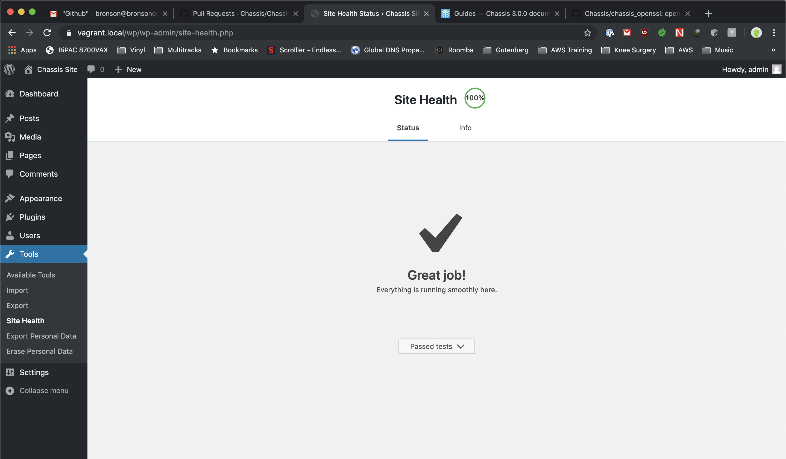

Guides
======

.. highlight:: yaml

These guides will help you configure Chassis for specific types of development.

Migrations
----------

Importing A Production Database Into Chassis
~~~~~~~~~~~~~~~~~~~~~~~~~~~~~~~~~~~~~~~~~~~~

#. Use ``ssh`` to connect to your production server. Your host should provide instructions for doing this.
#. Export your production database with `WP-CLI`_ ``wp db export <filename.sql>``.
#. Download your the contents of your ``wp-content`` folder on production to your local content folder.
#. Provision a new Chassis instance.
#. Copy the export into the ``content`` folder.
#. Run ``vagrant ssh`` in a terminal to SSH into your Chassis box.
#. Run ``cd /vagrant/content``
#. Run ``wp db import <filename.sql>``
#. Run ``wp search-replace '//www.yoursite.com/wp-content' '//vagrant.local/content'``
#. Run ``wp cache flush``
#. Start developing.

Alternatively you can use the `SequelPro`_ or `phpMyAdmin`_ extensions to handle importing and exporting of your databases.

You could also look at using the `db_backup`_ extension. You can commit an SQL export as a file called ``chassis-backup.sql`` and it should automatically import on install. You will still need to search and replace the URLs.

.. _SequelPro: https://github.com/Chassis/SequelPro
.. _phpMyAdmin: https://github.com/Chassis/phpMyAdmin
.. _db_backup: https://github.com/Chassis/db_backup
.. _WP-CLI: https://wp-cli.org/

Exporting A Development Database Into A Production Database
~~~~~~~~~~~~~~~~~~~~~~~~~~~~~~~~~~~~~~~~~~~~~~~~~~~~~~~~~~~

#. Add the production domain under ``- vagrant.local`` in ``content/config.local.yaml`` e.g. - ``www.yoursite.com``.
#. Reprovision with Puppet ``vagrant provision``.
#. SSH into your Chassis Box ``vagrant ssh``.
#. Use `WP-CLI`_ to search and replace e.g. ``wp search-replace '//vagrant.local' '//www.yoursite.com'``.
#. Use `WP-CLI`_ to search and replace the content urls. e.g. ``wp search-replace '//www.yoursite.com/content' '//www.yoursite.com/wp-content'``.
#. Export the database using `WP-CLI`_ ``wp db dump --add-drop-table``.
#. Log in to phpMyAdmin on your production server.
#. Drop the database on your site and import your database dump.
#. Upload your the contents of your ``content`` folder to your ``wp-content`` folder on production.
#. You're done!

N.B. If you getting the Error Establishing a Database Connection message then you'll probably need to edit the ``$table_prefix`` in ``wp-config.php``.

Alternatively you can use the `SequelPro`_ or `phpMyAdmin`_ extensions to handle importing and exporting of your databases.

.. _SequelPro: https://github.com/Chassis/SequelPro
.. _phpMyAdmin: https://github.com/Chassis/phpMyAdmin
.. _WP-CLI: https://wp-cli.org/

WP-CLI
------

`WP-CLI`_ is the command-line interface for WordPress. You can update plugins, configure multisite installations and much more, without using a web browser.

We bundle the latest version of WP-CLI in Chassis. You can access WP-CLI by running ``vagrant ssh`` from a terminal. You can check the WP-CLI details by running ``wp --info`` inside the Chassis box.
This should result in something like the following:

   vagrant@vagrant:~$ wp --info
   OS:	Linux 4.4.0-150-generic #176-Ubuntu SMP Wed May 29 18:56:26 UTC 2019 x86_64
   Shell:	/bin/bash
   PHP binary:	/usr/bin/php7.3
   PHP version:	7.3.8-1+ubuntu16.04.1+deb.sury.org+1
   php.ini used:	/etc/php/7.3/cli/php.ini
   WP-CLI root dir:	phar://wp-cli.phar/vendor/wp-cli/wp-cli
   WP-CLI vendor dir:	phar://wp-cli.phar/vendor
   WP_CLI phar path:	/home/vagrant
   WP-CLI packages dir:
   WP-CLI global config:	/home/vagrant/.wp-cli/config.yml
   WP-CLI project config:
   WP-CLI version:	2.3.0

WP-CLI Commands
~~~~~~~~~~~~~~~

You can see a full list of WP-CLI commands by running ``wp help`` inside your Chassis box. Some common commands are as follows:

* ``wp config list`` - Lists variables, constants, and file includes defined in wp-config.php file.
* ``wp cron event list`` - Lists scheduled cron events.
* ``wp cron event run`` - Runs the next scheduled cron event for the given hook.
* ``wp plugin list`` - Gets a list of plugins.
* ``wp plugin install <plugin_slug> --activate`` -- Install and activate a plugin from the WordPress plugin directory.
* ``wp post list`` - Gets a list of posts.
* ``wp post-type list`` - Lists registered post types.
* ``wp search-replace <old> <new>`` - Searches through all rows in a selection of tables and replaces appearances of the first string with the second string. Add the ``--dry-run`` parameter to test without making changes.
* ``wp shell`` - Evaluate PHP statements and expressions interactively, from within a WordPress environment. e.g. ``get_bloginfo( 'name' );``
* ``wp site empty`` - Empties a site of its content (posts, comments, terms, and meta).
* ``wp site create --slug=awesome`` - Creates a site in a multisite installation.

There is extensive documentation and examples of all the WP-CLI commands on the `WP-CLI`_ website.

.. _WP-CLI: https://wp-cli.org/

WP-CLI Packages
~~~~~~~~~~~~~~~

WP-CLI has additional `WP-CLI packages`_ which can be installed to add additional helper commands for your WordPress development needs.

We have made a `Chassis WP-CLI extension`_ that allows you to automatically install WP-CLI packages which have been published in the package index.

For example you could add the following section to one of your ``.yaml`` configuration files to automatically install the Chassis WP-CLI extension and the `WP-CLI Server`_ command.

.. code-block:: yaml

   wp_cli:
    packages:
        - wp-cli/server-command
        - wp-cli/restful

.. _WP-CLI packages: https://wp-cli.org/package-index/
.. _Chassis WP-CLI extension: https://github.com/Chassis/WP_CLI
.. _WP-CLI Server: https://github.com/wp-cli/server-command

Setting up SSL
--------------

To add an SSL to Chassis you need to do the following steps:

#. Add ``- chassis/chassis_openssl`` to one of your ``.yaml`` `configuration`_ files or run ``git clone https://github.com/Chassis/chassis_openssl.git extensions/chassis_openssl``.
#. Run ``vagrant provision``. This will create a ``vagrant.local.cert`` or ``<yoursitename>.local.cert`` and a ``vagrant.local.key`` or  `<yoursitename>.local.key` in the root directory of your Chassis folder.
#. Modify the ``WP_SITEURL`` and ``WP_HOME`` constants to use ``https://`` instead of ``http://``.
#. If you are using a Mac run ``sudo security add-trusted-cert -d -r trustRoot -k /Library/Keychains/System.keychain <yoursitename>.local.key``.
#. If you are using Windows run ``certutil -enterprise -f -v -AddStore "Root" "<yoursitename>.local.key"``.
#. Alternatively, you can read the `Chassis OpenSSL`_ readme for GUI options.

.. _configuration: http://docs.chassis.io/en/latest/config/
.. _Chassis OpenSSL: https://github.com/Chassis/chassis_openssl#gui-methods

WordPress Core Development
--------------------------

We have created an official Chassis extension for [WordPress Core](https://github.com/Chassis/core_dev) development. Follow the instructions in the README to get setup and help contribute to [WordPress Core](https://make.wordpress.org/docs/handbook/devhub/#to-get-involved).

Site Health
-----------

Out of the box Chassis will not meet the Site Health requirements checks in WordPress core. If you'd like to achieve
100% Site Health you will need to do the following:

1. Create a `local-config.php` with the following constants:

.. code-block:: php

   <?php
   define( 'AUTOMATIC_UPDATER_DISABLED', false );
   define( 'WP_DEBUG_LOG', false );
   define( 'WP_DEBUG', false );

2. Delete the inactive themes and plugins in both `content` and `wp/wp-content`.
3. Create a yaml configuration file with the following extensions:

.. code-block:: yaml

   extensions:
       - chassis/chassis_openssl
       - chassis/imagick
       - chassis/bcmath

4. Run ``vagrant provision``.
5. Follow the `Setting up SSL`_ guide to setup your site for SSL.
6. Create a file called ``ssl.php`` in `content/mu-plugins` with the following contents:

.. code-block:: php

   <?php
   add_filter( 'https_ssl_verify', '__return_false' );

7. **Caution:** Delete your ``.git`` folders.
8. You'll now have 100% Site Health!

.. _Setting up SSL: http://docs.chassis.io/en/latest/guides/#setting-up-ssl

Tester Extension
~~~~~~~~~~~~~~~~

The `Tester`_ extension adds and configures PHPUnit for WordPress tests. You can install other extensions if you want, but there's nothing else required.

.. _Tester: https://github.com/Chassis/Tester

Configuration
~~~~~~~~~~~~~

Save this configuration as ``config.local.yaml`` in the Chassis root directory to configure Chassis to look for WordPress in your ``wpcore/`` checkout.

.. code-block:: yaml

   paths:
       # Use the Chassis box normally...
       base: .
       content: content

       # But use my development copy of WordPress for the WP source
       wp: ../wpcore/src

   # Also use your development copy of WordPress for the unit test
   # framework, and for the unit tests themselves
   synced_folders:
       ../wpcore: /vagrant/extensions/tester/wpdevel

   # Set the host to ``core.local`` to distinguish from other chassis boxes
   hosts:
       - core.local

   # Explicitly set database configuration to avoid warning with Tester
   database:
       name: wordpress
       user: wordpress
       password: vagrantpassword
       prefix: wp_

   # Run in multisite mode (totally optional)
   multisite: true

WordPress will now be loaded from the ``wpcore/`` checkout, not the ``wp/`` directory within Chassis. However, in order for WP-CLI and other tools to be able to find Chassis' ``wp-config.php`` we need to add a dummy configuration file at ``wpcore/src/wp-config.php``:

.. code-block:: php

   <?php
   // Fool WP-CLI into recognising this as a valid config file
   if ( false ) {
       require ABSPATH . './wp-settings.php';
   }

   require '/vagrant/wp-config.php';

In normal circumstances editing Chassis' own ``wp-config.php`` file is discouraged in favor of using ``local-config.php``. However in this case you're working around WP-CLI with the dummy ``wp-config.php`` file, so you will need to make one change to Chassis' own ``wp-config.php`` file to wrap the line which requires ``wp-settings.php`` in a conditional check:

.. code-block:: php

   if ( ! defined( 'WP_CLI' ) ) {
       require_once( ABSPATH . 'wp-settings.php' );
   }

This will prevent WP-CLI from loading ``wp-settings.php`` twice.

With this configuration you should now be ready to develop against WordPress Core.

Vagrant Share
-------------

Vagrant Share enables the ability to generate a temporary URL which you can share with people to allow them access to your local Chassis installation.

1. **Install Vagrant Share**

   Run the following command in a terminal to install the `Vagrant Share plugin`_. ``vagrant plugin install vagrant-share``.

2. **Install ngrok**

   Vagrant Share requires ``ngrok`` to be installed on the host machine. You can verify if this is installed by running
   ``which ngrok`` in a terminal. If there is no output then you will need to download and install `ngrok`_. Once you've
   downloaded ``ngrok`` unzip it: ``unzip /path/to/ngrok-stable-darwin-amd64.zip``. Move ngrok:
   ``mv /path/to/ngrok /usr/local/bin/ngrok``. If you have `Homebrew`_ installed you can install ngok by running
   ``brew install eqnxio/ngrok/ngrok``.

3. **Run Vagrant Share**

   You now need to run ``vagrant share --http=vagrant.local:80``. If you're using a custom domain then you will need to use that e.g. ``vagrant share --http=<your-custom-domain>.local:80``.
   You will then have a temporary URL generated for you. e.g. ``http://<id>.ngrok.io``. You need to leave this running in the background.

4. **Share your site**

   Navigate to the URL that ngrok generated.

Testing a Chassis site from a Windows Virtual Machine
-----------------------------------------------------

When developing on a Mac or Linux host system, you may want to verify your website works properly in Internet Explorer or other windows-only browsers. Microsoft helpfully provides [virtual machine images for testing in Legacy Edge and IE11](https://developer.microsoft.com/en-us/microsoft-edge/tools/vms/). The following instructions detail how to access your Chassis site from within a browser running in a separate Windows 10 virtual machine.

1. **Get your Chassis machine's IP**

   From the command line within your Chassis folder, run ``vagrant ssh -c 'ifconfig'``. This sends a message into your Chassis environment to output the VM's internal network information. What we're looking for is the IP address assigned to the VM, which in our example case looks like this:

   ::

       eth1      Link encap:Ethernet  HWaddr 08:00:27:5d:c7:4f  
                 inet addr:172.28.128.17  Bcast:172.28.128.255  Mask:255.255.255.0

2. **Boot your Windows VM**

3. **Tell Windows the IP for your Chassis VM**

   Now that Windows is running and we've got our IP (``172.28.128.17`` in this example), right-click on Notepad within your Windows VM and select "run as administrator". Once Notepad is open, go to "Open a file".

   In Notepad's "open file" dialogue, navigate to the folder ``C:\Windows\System32\drivers\etc``. This folder may appear empty. This is a trick: it is not empty.

   Type "hosts" into the filename dialogue,

   .. image:: _static/windows-notepad-open-dialogue.png
      :alt: Windows Notepad "open" dialogue screenshot showing how to access the hosts file
   
   then hit "Open" to open the hidden hosts file.

   At the bottom of the file, add the IP from step 1 alongside your Chassis system's hostname. For example,

   ::

       172.28.128.17	chassis.local

4. **Test your Chassis site in IE or Edge**

   If you open a browser within your Windows VM and navigate to `chassis.local`, it should now connect to your Chassis site.
   
   Note: Windows will not be able to access other services running on your host OS, such as Webpack DevServer. For this reason, it is usually best to test IE and Edge using a static production build of your web application.

Debugging
~~~~~~~~~

If you see an error when you run ``vagrant provision`` then try running it again.
If you're still having trouble accessing the URL try a ``vagrant reload`` after you've run a successful ``vagrant provision``

.. _ngrok: https://dl.equinox.io/ngrok/ngrok/stable
.. _Vagrant Share plugin: https://www.vagrantup.com/docs/share/
.. _bug: https://github.com/hashicorp/vagrant/issues/10799
.. _Homebrew: https://brew.sh/
