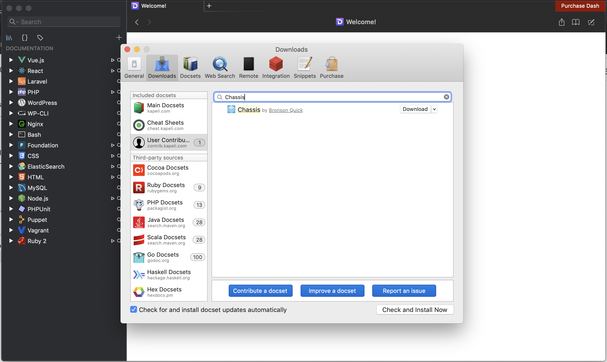

Reference
=========

Dash Documentation
------------------

The Chassis documentation can be downloaded and viewed in `Dash`_ on Mac. Simply search for Chassis in the User Contributed docs.

Other alternatives have been developed in cooperation with Dash.app’s developer Kapeli:

* `Helm Dash`_ for Emacs.
* `Velocity`_ for Windows.
* `Zeal`_ for Linux, macOS, and Windows.

.. _Dash: https://kapeli.com/dash
.. _Helm Dash: https://github.com/dash-docs-el/helm-dash
.. _Velocity: http://velocity.silverlakesoftware.com/
.. _Zeal: https://zealdocs.org/

.. highlight:: console

Commands
--------

This is a very quick reference of Vagrant commands we find useful. For the full
documentation, check out the `Vagrant command reference`_.

.. _Vagrant command reference: https://docs.vagrantup.com/v2/cli/index.html

::

  # Start the VM
  vagrant up

  # SSH in to the VM
  vagrant ssh

  # Reprovisioning (e.g. after updating this repository)
  vagrant provision

  # Suspending (sleeping) the VM
  vagrant suspend

  # Halting (shutting down) the VM
  vagrant halt

  # Reboot (halt and up)
  vagrant reload

  # Destroying the VM (if your VM is completely broken)
  vagrant destroy

Building a new Base Box for Vagrant Cloud
-----------------------------------------

The `Chassis base boxes`_ are generated by the Chassis team and they are uploaded to Vagrant Cloud.

The Chassis base box will follow the `SEM Versioning 2.0.0`_ specification which is ``MAJOR.MINOR.PATCH``.
For example:

1. MAJOR version 2.0.0 - This would be a new Ubuntu distribution. e.g. Bionic Beaver.
2. MINOR version 1.1.0 - This would be when we have added a new Chassis feature. e.g. `upload_size`
3. PATCH version 1.0.1 - This would be when the Ubuntu base box has had an update or a bug fix.

To generate and upload a new base box a Vagrant Cloud Chassis team member will need to do the following:

1. Open a new issue in the Chassis repository with details about the base box updates.
2. Create a new branch off ``master`` for the base box updates.
3. Backup any custom yaml configuration files you have as they will be deleted during this process.
4. Delete any extensions in your ``extensions`` folder (apart from ``example`` as it's required).
5. Bump the version number of the base box in the `build script`_, `yaml file`_ and `documentation`_.
6. Change ``_mode: normal`` to ``_mode: base`` in ``config.yaml``.
7. Run ``vagrant destroy -f``.
8. Run ``vagrant up``.
9. Run ``sh buildbox.sh`` in the root directory of Chassis.
10. Login to your Vagrant Cloud account when you are prompted to do so.
11. Wait for the upload to complete.
12. Submit a Pull Request and wait for one of the Chassis team members to approve it.

.. _Chassis base boxes: https://app.vagrantup.com/chassis
.. _SEM Versioning 2.0.0: https://semver.org/
.. _build script: https://github.com/Chassis/Chassis/blob/master/buildbox.sh#L55
.. _yaml file: https://github.com/Chassis/Chassis/blob/master/config.yaml#L13
.. _documentation: https://github.com/Chassis/Chassis/blob/main/docs/conf.py#L56-L59

Troubleshooting
---------------

Logs
----

Chassis synchronises the Nginx and PHP log files from the Virtual Machine to your local development folder. These logs can be useful if your provisions are failing and you require further information.

There are three logs that we synchronise for you:

1. ``logs/php/php_errors.log`` - This shows any PHP errors or warnings that have occurred.
2. ``logs/nginx/error.log`` - This shows any errors that have occurred.
3. ``logs/nginx/access.log`` = This shows details of any requests that Nginx has served.

It is also recommended to update your Chassis box in case of package installation issues, eg: expired certificates.

Character encoding on Windows machines
--------------------------------------

::

  $ vagrant up
  Bringing machine 'default' up with 'virtualbox' provider...
  ==> default: Importing base box 'bento/ubuntu-16.04'...
  C:/Vagrant/embedded/gems/2.1.1/gems/childprocess-0.6.3/lib/childprocess/windows/process_builder.rb:43:in `join': incompatible character encodings: Windows-1252 and UTF-8 (Encoding::CompatibilityError)

To resolve this issue you'll need to create a symlink and set the VAGRANT_HOME path. e.g.

::

  $ cd C:\users
  $ mklink /J username usérnamé
  $ setx VAGRANT_HOME "C:/users/username"

Alternatively you can set the path for VirtualBox to a directory that doesn't have special characters. To do this open the VirtualBox application, select 'File' -> 'Settings' -> 'General' and change the default path for VM's (e.g. to "C:\VirtualBox VMs").

Server IP address could not be found. (DNS_PROBE_FINISHED_NXDOMAIN)
---------------------------------------------------------------------

This typically occurs on Mac when the DNS configuration has not been set up properly during the installation. SSH into the Chassis machine and run ``sudo service avahi-daemon restart``
